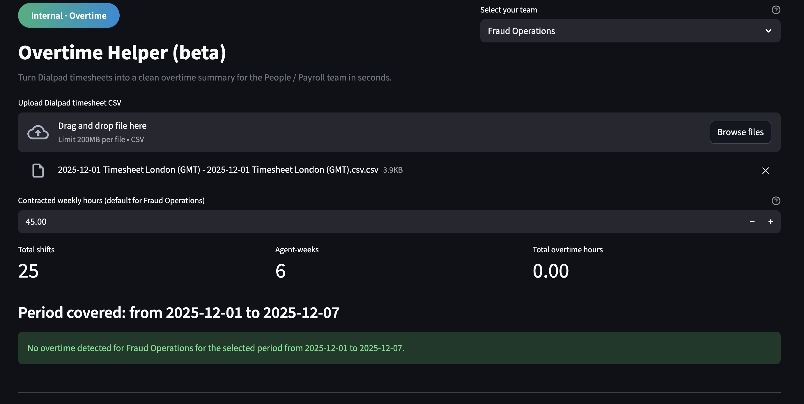

# Overtime Helper (beta)

> Small internal tool to turn Dialpad WFM timesheet exports into clean overtime summaries for People / Payroll.

---

## Background / Story

Overtime Helper started as a practical side project to remove manual overtime admin for an operations team in a fintech company.

Team leads were:

- Updating schedules and overtime in **Dialpad WFM**,
- Exporting CSVs every month,
- Then manually building overtime sheets for the People / Payroll team.

The idea behind Overtime Helper was simple:

> “If the data already lives in Dialpad, we should be able to upload one CSV and get a clean overtime summary out – ready for People – without rebuilding it in spreadsheets every time.”

What began as a quick Python script evolved into a small Streamlit app that any manager can use locally: upload a CSV, select their team, and copy a ready-made message for People in seconds.

---

## Overview

Overtime Helper is a lightweight Python + Streamlit app that:

- Takes a **Dialpad timesheet CSV** as input
- Calculates **weekly hours and overtime** per colleague
- Rolls this up into a **period summary** (e.g. a month)
- Generates:
  - Downloadable **weekly** and **period** overtime CSVs
  - A ready-to-edit **Slack/email message** for the People / Payroll team

Originally built for a Fraud Operations team, but the app supports multiple teams (Fraud Ops, Customer Support, Core Ops / Payment Ops, Compliance Ops) via a simple dropdown.

The goal is to remove manual overtime spreadsheets for team leads while keeping Dialpad as the single source of truth.

---

## Screenshots



---

## Features

- 📤 **Upload** – drag and drop a Dialpad WFM timesheet CSV
- 👥 **Team selection** – choose your team from a dropdown
  - Fraud Operations
  - Customer Support
  - Core Ops / Payment Ops
  - Compliance Ops
- ⏱️ **Overtime calculation**
  - Groups data by `full_name + email + week_start`
  - Uses a configurable **contracted weekly hours** value
  - Flags hours above contract as **overtime**
- 📊 **Summaries**
  - **Weekly summary** per colleague per week
  - **Period summary** per colleague across the uploaded date range
- 📨 **Suggested message for People / Payroll**
  - Auto-generated text that states:
    - the team
    - the date range
    - total overtime hours (or “no overtime”)
  - Editable in the UI
  - One-click **“Copy to clipboard”** button
- 📁 **Downloads**
  - `ot_weekly_summary.csv`
  - `ot_monthly_summary.csv` (period summary)

---

## Tech stack

- **Language:** Python 3.9
- **Libraries:**
  - [Streamlit](https://streamlit.io/) – UI, file upload, layout
  - [pandas](https://pandas.pydata.org/) – CSV parsing and overtime calculations
- **Other bits:**
  - Small amount of **HTML/CSS/JS** inside Streamlit for:
    - pill-style header badge
    - “Copy to clipboard” behaviour on the suggested message

The app currently runs **locally** in a Python virtual environment. No external APIs are called.

---

## Project structure

```text
ot-helper/
├── app.py                 # Streamlit UI
├── ot_helper.py           # Core overtime calculation logic (CLI-style)
├── requirements.txt
├── .gitignore
├── docs/
│   ├── overtime-helper-main.png
│   └── overtime-helper-summary.png
└── example_timesheet.csv  # (optional) anonymised sample Dialpad export
```

Getting started
Prerequisites

Python 3.9+

pip installed

1. Clone the repo
   git clone https://github.com/<your-username>/overtime-helper.git
   cd overtime-helper

2. Create and activate a virtual environment (recommended)
   python3 -m venv venv
   source venv/bin/activate # macOS / Linux

# venv\Scripts\activate # Windows (PowerShell or CMD)

3. Install dependencies
   pip install -r requirements.txt

4. Run the app
   streamlit run app.py
   Streamlit will open the app in your browser (usually at http://localhost:8501).

How to use

Select your team from the dropdown (Fraud Operations, Customer Support, Core Ops / Payment Ops, Compliance Ops).

Set the contracted weekly hours for that team (e.g. 45).

Export the standard timesheet CSV from Dialpad WFM.

Upload the CSV into Overtime Helper.

Review the results:

Top-level metrics (total shifts, agent-weeks, total overtime hours)

Weekly and period summaries

“No overtime detected…” message or a list of colleagues with overtime

Copy the suggested message into Slack/email and attach the downloaded CSVs for People / Payroll.

Data & privacy

The app only processes data from the uploaded Dialpad CSV.

All processing happens locally on the user’s machine.

No data is sent to external services unless a user manually shares the generated CSVs.

For real company use, keep Dialpad exports and OT outputs out of Git history and shared repos.

Roadmap / ideas

🔐 Hosted internal instance (rather than local only)

⚙️ Config UI for contracted hours & per-user overrides (no code edits)

📈 Downloadable or embedded charts (OT trend over time, per team / person)

🔗 Direct API integrations with WFM / payroll tooling (where available)
